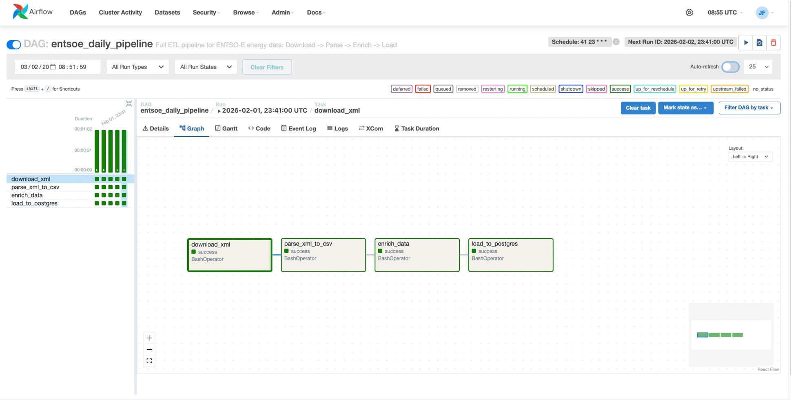
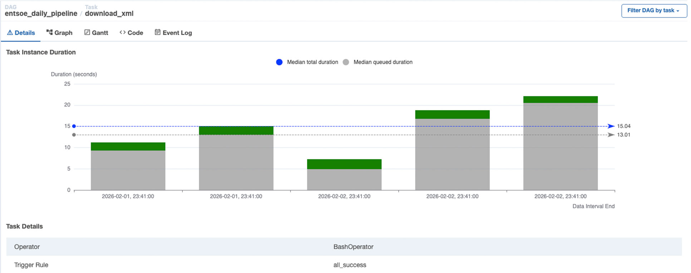

# EU Energy Data Pipeline (ENTSO-E) - v2.0



An automated, end-to-end **Data Engineering Pipeline** that ingests, processes, and analyzes real-time electricity data from the **ENTSO-E API**. 

This version introduces **Workflow Orchestration with Apache Airflow**, dynamic data partitioning, and a robust multi-country/multi-type (Generation & Prices) architecture.

---

## 🏗️ System Architecture

The pipeline follows a modern **Medallion-like Architecture** (Raw → Processed → Enriched) orchestrated by Airflow:

1.  **Extraction (Bronze):** Ingests multi-country XML data (Generation & Prices) via REST API.
2.  **Parsing (Silver):** Converts complex XML namespaces into structured, partitioned CSVs.
3.  **Enrichment (Gold):** Maps technical codes to human-readable reference data (PSR Types, Countries).
4.  **Loading:** Upserts clean data into **PostgreSQL** using `ON CONFLICT` logic for idempotency.
5.  **Analytics:** Ready for **Power BI / Streamlit** consumption.


---

## 🛠️ Tech Stack

* **Orchestration:** Apache Airflow (DAGs, Task Monitoring, Backfilling).
* **Language:** Python 3.11+ (Pandas, Requests, Psycopg2).
* **Database:** PostgreSQL (Relational Storage & Time-series data).
* **Infrastructure:** Docker & Docker-Compose (Ready for deployment).
* **Data Source:** ENTSO-E Transparency Platform API.

---

## 📂 Project Structure

```bash
eu-energy-data-pipeline/
├── airflow_home/            # Airflow configuration, logs & local state
│   └── dags/
│       └── entsoe_daily_pipeline.py
├── ingestion/               # Extraction layer (API connectors)
│   └── fetch_entsoe_data.py
├── processing/              # Transformation & Load layer
│   ├── parse_generation_xml.py
│   ├── enrich_generation_data.py
│   └── load_generation_to_postgres.py
├── data/                    # Partitioned Data Lake 
│   ├── raw/                 # Original XMLs stored by date (YYYY/MM/DD)
│   ├── processed/           # Parsed & Enriched CSVs ready for DB
│   └── reference/           # Static mapping files (Countries, PSR Types)
├── assets/                  # Documentation images and screenshots
├── .env                     # API Keys & DB Credentials (ignored by git)
├── Dockerfile               # Custom Airflow image definition
├── docker-compose.yml       # Infrastructure orchestration
└── requirements.txt         # Python dependencies
```

## 🐳 Dockerization

The project is fully containerized to ensure environment consistency and easy deployment. The `docker-compose.yaml` orchestrates:

* **PostgreSQL**: Persistent storage for enriched energy data.
* **Airflow Scheduler**: Handles the logic and timing of the ETL tasks.
* **Airflow Webserver**: Provides the UI for monitoring and management.
* **Airflow Init**: Handles database migrations and user creation.
  
## ⚡ Key Features

* **Dynamic Backfilling**: Leveraging Airflow's `catchup=True` to recover historical data automatically.
* **SLA & Performance Monitoring**: Real-time tracking of task duration and latency analysis.
* **Idempotency**: Scripts are designed to be re-run for the same date without duplicating data in PostgreSQL.
* **Multi-Category Support**: Integrated processing for both **Electricity Generation** and **Day-Ahead Prices**.

---

## 📈 Performance Monitoring

We utilize Airflow's **Task Duration** metrics to ensure pipeline health and monitor API latency, ensuring our **SLA (Service Level Agreement)** for data availability is met.



---

## 🚀 Pipeline Flow

The workflow is organized in a linear dependency to ensure data integrity:


1. **Download**: Fetches data based on the Airflow `execution_date`.
2. **Parse**: Extracts values from XML namespaces into daily partitioned folders.
3. **Enrich**: Merges technical PSR codes with human-readable labels.
4. **Load**: Performs a batch `INSERT` into PostgreSQL with `ON CONFLICT DO NOTHING`.

---

## 🏷️ Release History

* **v1.0.0** - Initial functional pipeline (Script-based).
* **v1.1.0** - Dockerization of the database and ingestion services.
* **v2.0.0 (Current)** - Full Airflow orchestration, Multi-XML parsing, and Dynamic ETL.

---

## 👤 Author
### **Jean-François Bourgeois**
**Data Engineering Portfolio Project**
Designed to demonstrate proficiency in API integration, workflow orchestration, and scalable data modeling.